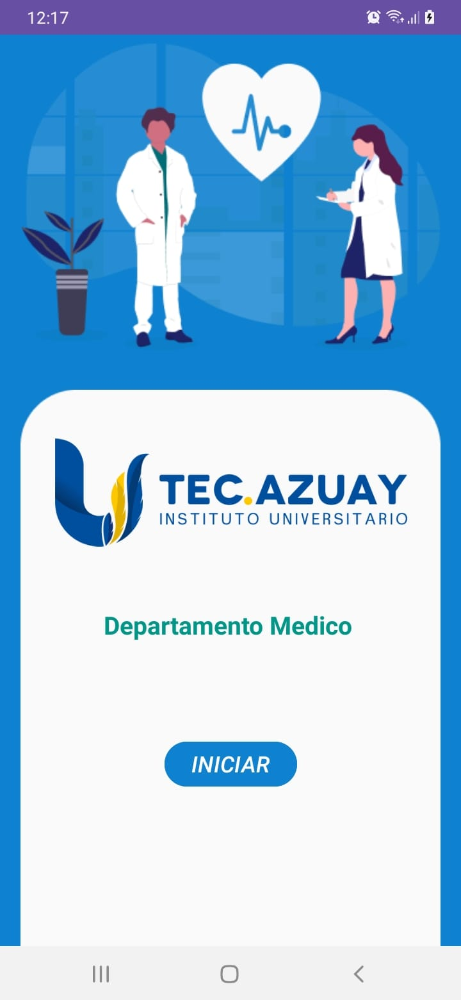
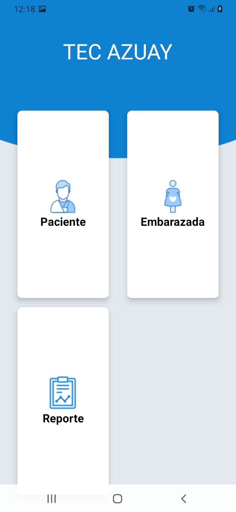
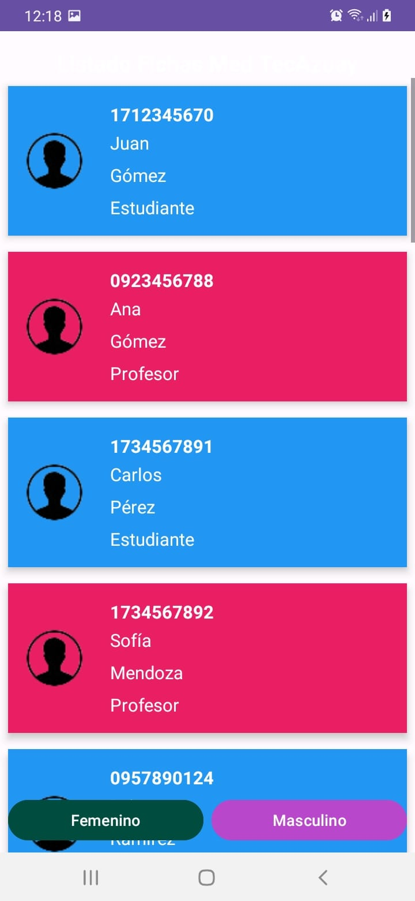

# 📱 TECAZUAY Registros Médicos - App Móvil

## 📌 Descripción del Proyecto

Aplicación móvil nativa para Android desarrollada para el **Sistema Integrado de Administración de Registros Médicos del TECAZUAY**. Permite al personal de salud consultar y registrar información del paciente directamente desde dispositivos móviles en el punto de atención.

---

## 🛠️ Tecnologías Utilizadas

* **Plataforma:** Android Nativo
* **Lenguaje:** Kotlin
* **Consumo de Servicios:** Retrofit / OkHttp (API REST RESTful)
* **Entorno de Desarrollo:** Android Studio
* **Control de Versiones:** Git / GitHub

---

## 📲 Funcionalidades de la App Móvil

* **🔐 Acceso Autenticado:** Inicio de sesión seguro con control de permisos por rol.
* **📋 Consulta de Fichas Médicas:** Visualización móvil de datos de afiliación y antecedentes familiares de pacientes.
* **🩺 Atención Médica Móvil:** Captura ágil de signos vitales e historiales de consulta.
* **🔍 Búsqueda Rápida:** Interfaz optimizada para dispositivos táctiles conectada a la API central.

---

## 👨‍💻 Mis Contribuciones (Bryan Farez)

* **Desarrollo de Vistas:** Maquetación e implementación de pantallas para las Fichas de Afiliación y Antecedentes.
* **Integración API:** Conexión de las peticiones móviles en Kotlin con la API REST de Spring Boot.
* **QA & Pruebas:** Verificación de la respuesta, adaptabilidad e integración con el Backend.

---
## 📸 Capturas de la Aplicación Móvil

| Inicio de Sesión | Menú Principal / Módulos | Gestión de Pacientes |
| :---: | :---: | :---: |
|  |  |  |

---
## 🔗 Repositorios del Sistema Integrado

* ⚙️ **Backend API:** [HistorialClinico](https://github.com/Bfarez21/HistorialClinico)
* 💻 **Frontend Web:** [TFC-Fronted-M4A](https://github.com/Bfarez21/TFC-Fronted-M4A)
* 📱 **App Móvil:** [HistorialClinicoTFC4](https://github.com/Bfarez21/HistorialClinicoTFC4)
